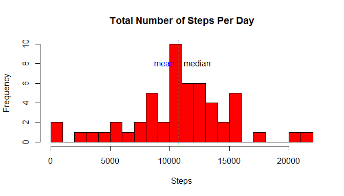
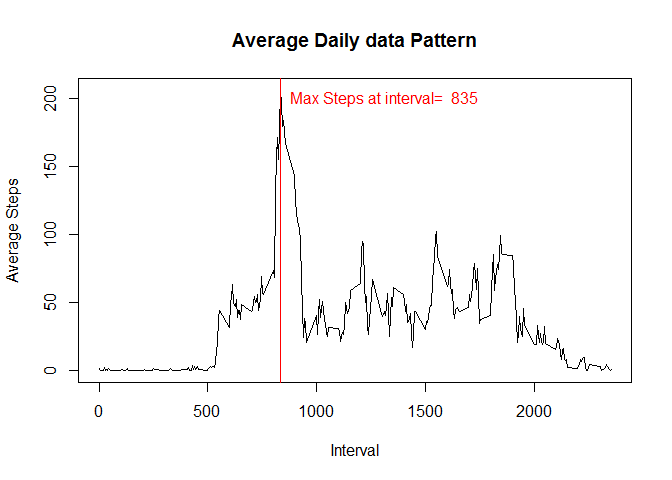
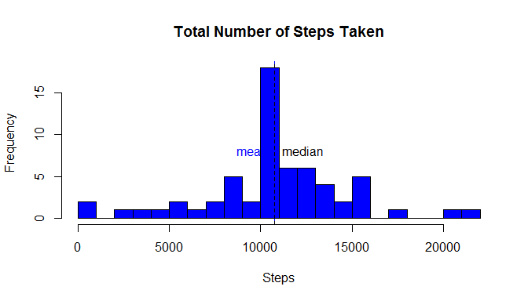
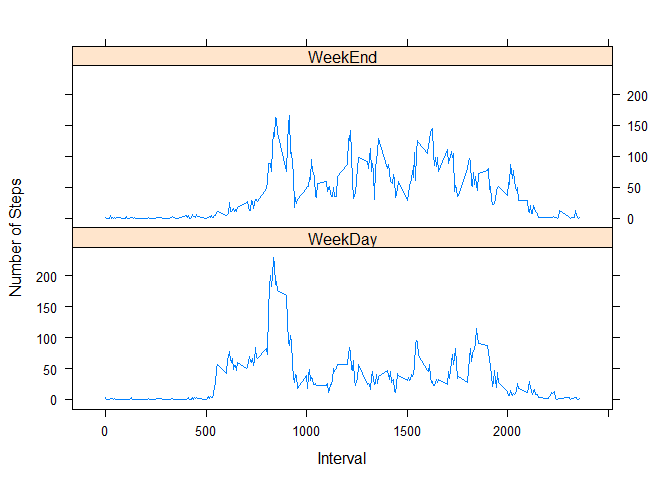

# Reproducible Research: Peer Assessment 1

## Install packages if not already installed

```r
# install.packages("lattice")
```

## Reference required packages

```r
library(lattice)
```

```
## Warning: package 'lattice' was built under R version 3.2.5
```

## Loading and preprocessing the data
Load the data data

```r
# Download and extract the data.zip file 
# place file into working directory
# Note: Working directory is the directory where PA1_template.Rmd file stored
```

```r
data <- read.csv("activity.csv", header=T, sep=",", na.strings="NA")
```

Pre Process/transform the data into format of date into YYYY-MM-DD format.


```r
data$date<-as.Date(data$date, "%Y-%m-%d")
head(data)
```

```
##   steps       date interval
## 1    NA 2012-10-01        0
## 2    NA 2012-10-01        5
## 3    NA 2012-10-01       10
## 4    NA 2012-10-01       15
## 5    NA 2012-10-01       20
## 6    NA 2012-10-01       25
```

## What is mean total number of steps taken per day?

Since the data provided is recorded in every five minutes period the data needs to be aggregated 
and grouped by date. Hence, steps per day can be found.


```r
data.dailySteps<-aggregate(data$steps,by=list(data$date), sum)
names(data.dailySteps)<-c('Date','Steps')
```


Mean and median can be found after per day steps calculation.

Calculation of mean and median of total no of steps

```r
data.steps_mean <-mean(data.dailySteps$Steps,na.rm=TRUE)
data.steps_median<-median(data.dailySteps$Steps,na.rm=TRUE)
```
Reporting of mean and median of total no of steps

Mean of steps taken : **10766.19**  
Median of steps taken : **10765**

Plotting Histrogram of daiy steps taken

```r
hist(data.dailySteps$Steps, 
      main="Total Number of Steps Per Day", 
      xlab="Steps",
      ylab = "Frequency",
      breaks=20,
      col='red')

abline(v=data.steps_mean, lty=1, col="blue")
text(data.steps_mean,8, labels="mean", col="blue", pos=2)
abline(v=data.steps_median, lty=2, col="green")
text(data.steps_median,8, labels="median", col="black", pos=4)
```

<!-- -->

## What is the average daily data pattern?

Make a time series plot (i.e. type = "l") of the 5-minute interval (x-axis) and the average number of steps taken, averaged across all days (y-axis)

```r
tidydata<-na.omit(data)
data.StepsInIntervals<-aggregate(tidydata$steps,by=list(tidydata$interval), mean)
names(data.StepsInIntervals)<-c('Interval','AverageSteps')
plot(data.StepsInIntervals, type="l", 
     xlab="Interval", 
     ylab="Average Steps", 
     main="Average Daily data Pattern")

IndexOfMaxnoofSteps<- which.max(data.StepsInIntervals$AverageSteps)
MaxnoofSteps<-data.StepsInIntervals[IndexOfMaxnoofSteps,]$AverageSteps
InterValOfMaxnoofSteps<-data.StepsInIntervals[IndexOfMaxnoofSteps,]$Interval
abline(v= InterValOfMaxnoofSteps, lty=1,col="red")
text(InterValOfMaxnoofSteps,200, labels=paste("Max Steps at interval= ",InterValOfMaxnoofSteps) , col="red", pos=4)
```

<!-- -->


Which 5-minute interval, on average across all the days in the dataset, contains the maximum number of steps?

_The **835**th  interval has maximum number of steps._


# Imputing missing values

1. Calculate and report the total number of missing values in the dataset (i.e. the total number of rows with NAs)

_There are total of **17568** Observations of which **2304** are missing values in the dataset ._

2. Devise a strategy for filling in all of the missing values in the dataset. The
strategy does not need to be sophisticated. For example, you could use
the mean/median for that day, or the mean for that 5-minute interval, etc.

_New data set shall be calculated by assiging average values of the time interval from all days._

3. Create a new dataset that is equal to the original dataset but with the
missing data filled in.


```r
#find vector of na values
isna<-is.na(data$steps)
missingdata <- data[isna,]
#find indexes of average steps data matching its interval to missing data.
missing_averagedataindex <- match(missingdata$interval,data.StepsInIntervals$Interval)
newDataSteps<- data
newDataSteps$steps[isna] <- data.StepsInIntervals$AverageSteps[missing_averagedataindex]
head(newDataSteps)
```

```
##       steps       date interval
## 1 1.7169811 2012-10-01        0
## 2 0.3396226 2012-10-01        5
## 3 0.1320755 2012-10-01       10
## 4 0.1509434 2012-10-01       15
## 5 0.0754717 2012-10-01       20
## 6 2.0943396 2012-10-01       25
```


4. Make a histogram of the total number of steps taken each day and Calculate
and report the mean and median total number of steps taken per day. Do
these values differ from the estimates from the first part of the assignment?
What is the impact of imputing missing data on the estimates of the total
daily number of steps?


```r
newDataSteps.dailySteps<-aggregate(newDataSteps$steps,by=list(newDataSteps$date), sum)
names(newDataSteps.dailySteps)<-c('Date','Steps')

newDataSteps.steps_mean <-mean(newDataSteps.dailySteps$Steps,na.rm=TRUE)
newDataSteps.steps_median<-median(newDataSteps.dailySteps$Steps,na.rm=TRUE)
```
The mean of steps taken is **10766.19**  
The median of steps taken is **10766.19**

A Histrogram Showing daiy steps taken

```r
hist(newDataSteps.dailySteps$Steps,
     main="Total Number of Steps Taken", 
     xlab="Steps", 
     breaks=20,
     col='blue')

abline(v=newDataSteps.steps_mean, lty=1, col="blue")
text(newDataSteps.steps_mean,8, labels="mean", col="blue", pos=2)
abline(v=newDataSteps.steps_median, lty=2, col="black")
text(newDataSteps.steps_median,8, labels="median", col="black", pos=4)
```

<!-- -->
The difference in mean data after imputing data is
**0**
The difference in median data after imputing data is
**1.1886792**
Also the mean and median has become equal now.


## Are there differences in data patterns between weekdays and weekends?

Create a new factor variable in the dataset with two levels - "weekday"
and "weekend" indicating whether a given date is a weekday or weekend
day.


```r
isweekedn<- ifelse(weekdays.Date(newDataSteps$date)=='Sunday' | weekdays.Date(newDataSteps$date) =='Saturday','WeekEnd','WeekDay')
newDataSteps$dayType<-factor(isweekedn)
```

Make a panel plot containing a time series plot (i.e. type = "l") of the
5-minute interval (x-axis) and the average number of steps taken, averaged
across all weekday days or weekend days (y-axis).


```r
averageStepsbyInterval<-aggregate(newDataSteps$steps,by=list(newDataSteps$interval,newDataSteps$dayType), mean)
names(averageStepsbyInterval)<-c('interval','day','averageSteps')
xyplot(averageSteps~interval|factor(day),
        data = averageStepsbyInterval,
       type='l',layout=c(1,2),
       xlab='Interval',ylab='Number of Steps')
```

<!-- -->
